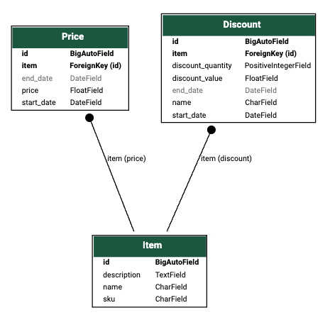

# Checkout System

This repository contains a simple checkout system implemented in Python. The application allows calculating the total price of a shopping cart based on a set of pricing rules for items.

The project has two versions: Version A is implemented with simple Python scripts, while Version B is a Django application with a more structured database modeling to handle more scenarios.

Screenshots of passed tests can be found in documentation folder.

## --- Version A ---

## Testing checkout

To run tests, follow these steps:

1. Ensure you have Python 3.8 installed on your system.
2. Clone this repository to your local machine.
3. Navigate to the project directory (version_A).
4. Run the `tests.py` file using Python 3.8:

   ```
   python tests.py
   ```
   
This will execute the tests and display the output, which includes information on item pricing and the results.

```
Running on the following Item pricing:
----------------------------------------
Item A. Unit price: 50, Special Price: 130 for 3 units
Item B. Unit price: 30, Special Price: 45 for 2 units
Item C. Unit price: 20. No discounts.
Item D. Unit price: 15. No discounts.
----------------------------------------
Total elements in cart: {}
Total price for your cart: 0
Test with 0 items passed

Total elements in cart: {'A': 1}
Total price for your cart: 50
Test A passed

Total elements in cart: {'A': 1, 'B': 1}
Total price for your cart: 80
Test AB passed

Total elements in cart: {'C': 1, 'D': 1, 'B': 1, 'A': 1}
Total price for your cart: 115
Test CDBA passed

Total elements in cart: {'A': 2}
Total price for your cart: 100
Test AA passed

Total elements in cart: {'A': 3}
Total price for your cart: 130
Test AAA passed

Total elements in cart: {'A': 4}
Total price for your cart: 180
Test AAAA passed

Total elements in cart: {'A': 5}
Total price for your cart: 230
Test AAAAA passed

Total elements in cart: {'A': 6}
Total price for your cart: 260
Test AAAAAA passed

Total elements in cart: {'A': 3, 'B': 1}
Total price for your cart: 160
Test AAAB passed

Total elements in cart: {'A': 3, 'B': 2}
Total price for your cart: 175
Test AAABB passed

Total elements in cart: {'A': 3, 'B': 2, 'D': 1}
Total price for your cart: 190
Test AAABBD passed

Total elements in cart: {'D': 1, 'A': 3, 'B': 2}
Total price for your cart: 190
Test DABABA passed

```

## Custom checkout

To execute the `main.py` file and interact with user input, follow these steps:

1. Run the `main.py` file by typing the following command and pressing Enter:

   ```
   python main.py
   ```

2. Once the command is executed, the program will start running and prompt the user to input a custom cart. The user can input the SKUs of the desired items in the cart. For example:

   ```
   Enter your cart items (e.g., 'ABCD'): AAAABBBC
   ```

3. After entering the item SKUs, press Enter. The program will then calculate the total price of the cart based on the defined pricing rules and print the result.


## Code Structure

The code is divided into the following files:

- `item_pricing.py`: contains the dictionary with the fixed prices of products.
- `main.py`: Calculates the total price of a user custom cart.
- `test.py`: Contains asserts for tests.
- `utils.py`: Contains utility functions, in this case, only the print function.
- `checkout_system.py`: Contains functions that handle the calculation of cart prices based on `items_pricing`.
- `models.py`: Contains classes that map real-world objects, in this case, only `Item`.

## --- Version B ---

This version implements a django alternative with simple data modeling.


- Each Item can have multiple Prices valid depending on the date.
- Each Item can have multiple Discounts applicable to it depending on the date.

## Testing checkout

To run tests, follow these steps:

1. Navigate to the project directory (version_B > django_supermarket).
2. Install a venv with requirements.txt.
3. Run `python manage.py test checkout      `

## Code Structure

The checkout app contains:

- `checkout_system.py`: Contains the class for price calculation. It handles query on db to get item prices.
- `models.py`: Contains the three django models.
- `tests.py`: Contains assert for tests.