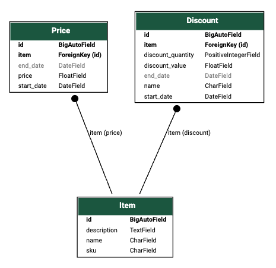

# Version B

This version implements a django alternative with simple data modeling.

- Each Item can have multiple Prices valid depending on the date.
- Each Item can have multiple Discounts applicable to it depending on the date.

## Testing checkout

To run tests, follow these steps:

1. Navigate to the project directory (version_B > django_supermarket).
2. Install a venv with requirements.txt. `pip install -r requirements.txt`
3. Run `python manage.py test checkout      `

## Code Structure

The checkout app contains:

- `checkout_system.py`: Contains the class for price calculation. It handles query on db to get item prices.
- `models.py`: Contains the three django models.
- `tests.py`: Contains assert for tests.